# OS-LAB
operating system lab
#BASIC LINUX COMMANDS
##General command outputs
### bc command output

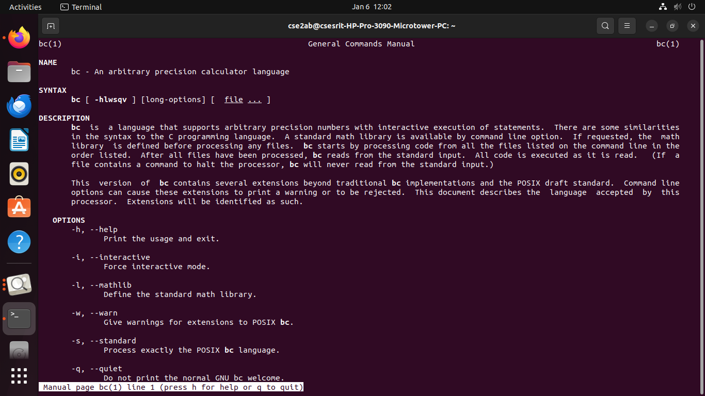
### cp command output

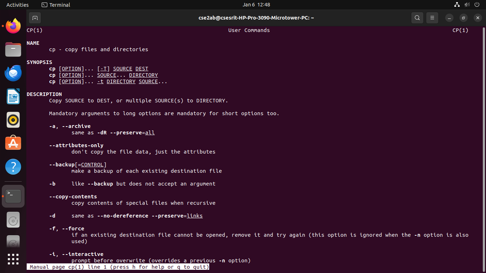
### date command output
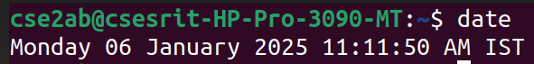
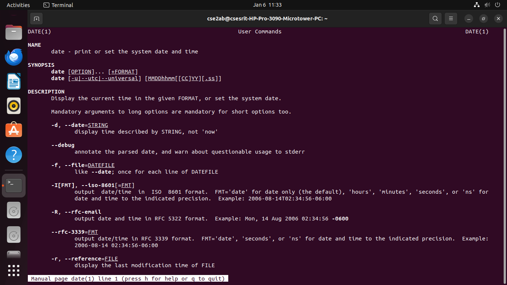
### cat command output
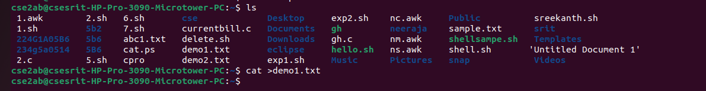
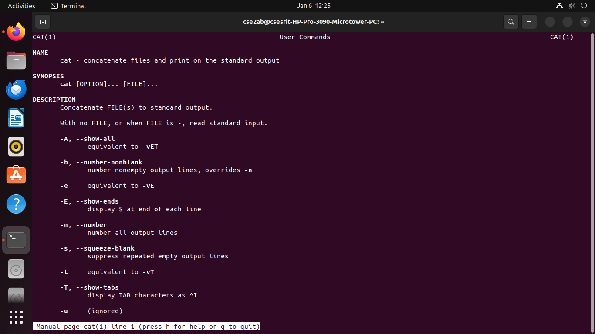
### echo command output
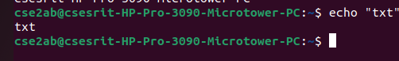

### mv command output
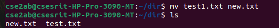
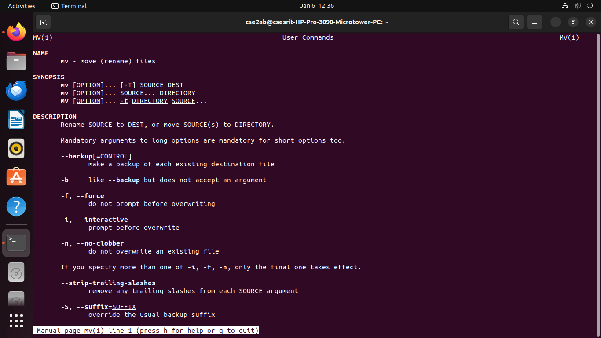
### rmdir command output
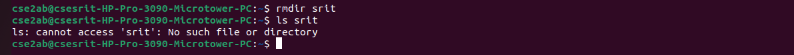
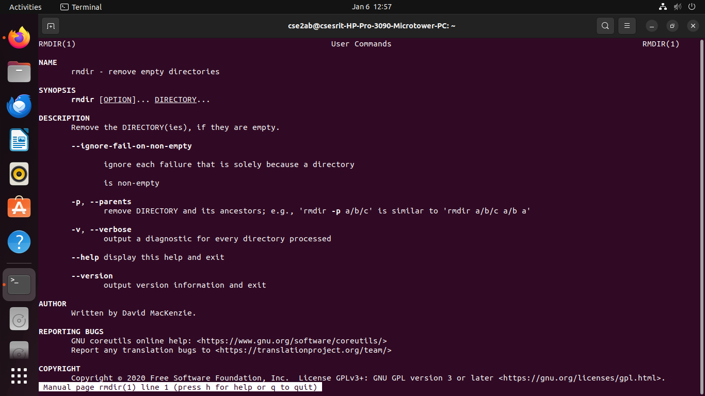
### rm command output

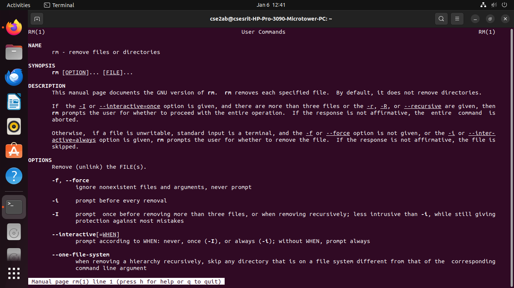
### tty command output

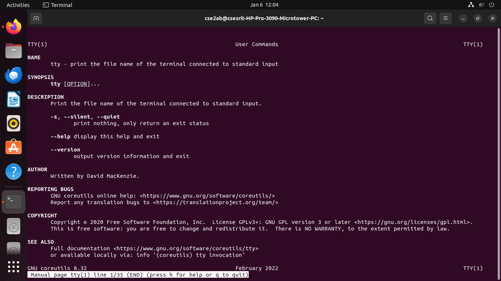
### who command output
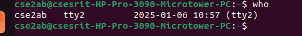
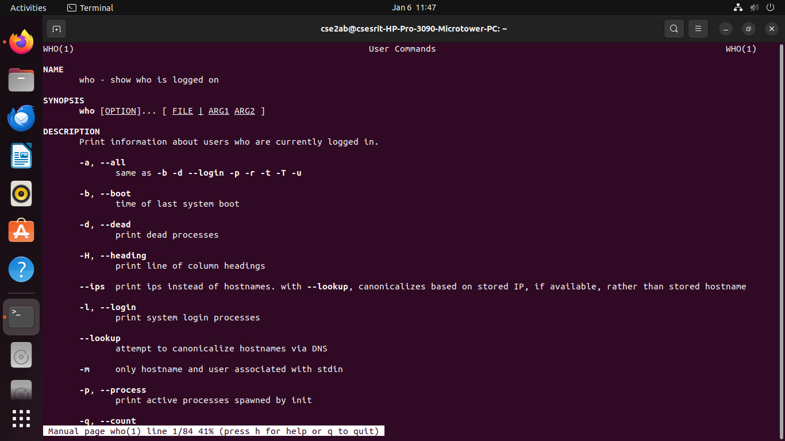
### uname command output

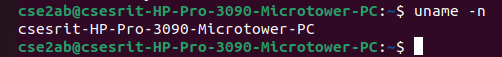
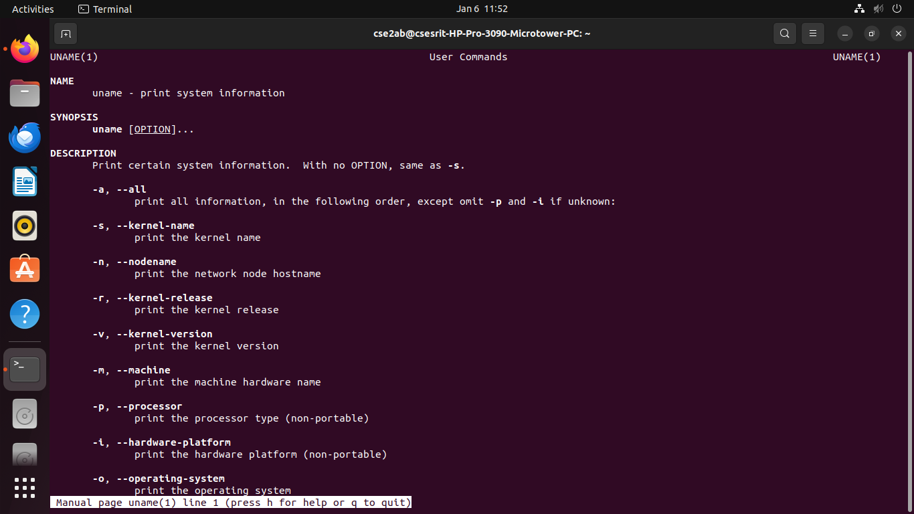
### mkdir command output
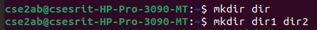
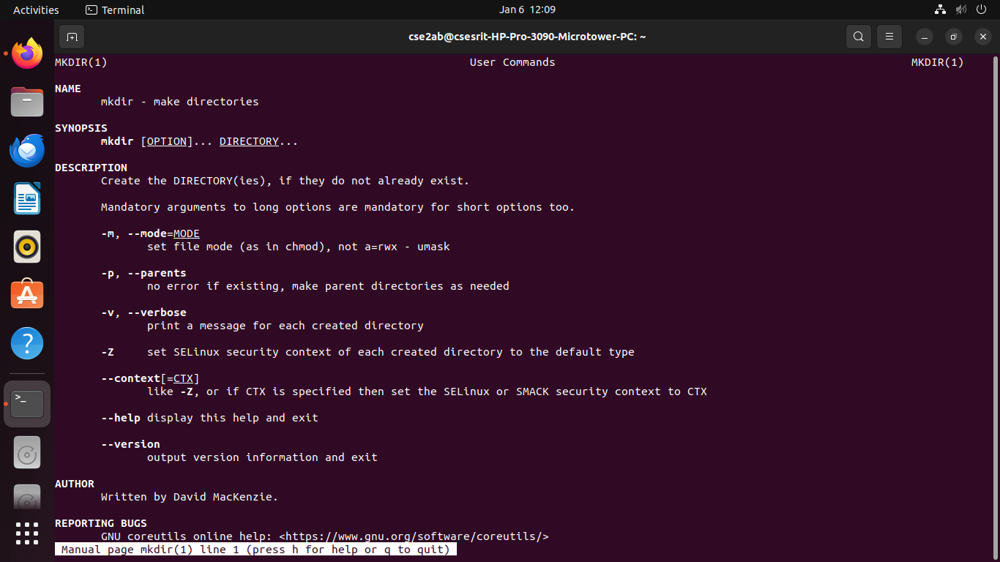
### pwd command output
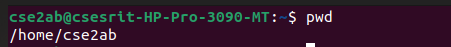
### chmod command output
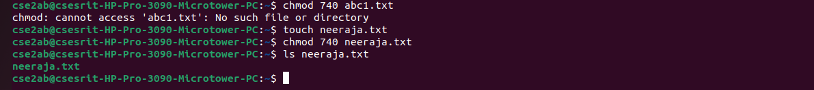

### cd command output

### ls command output
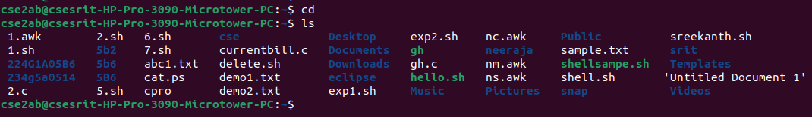
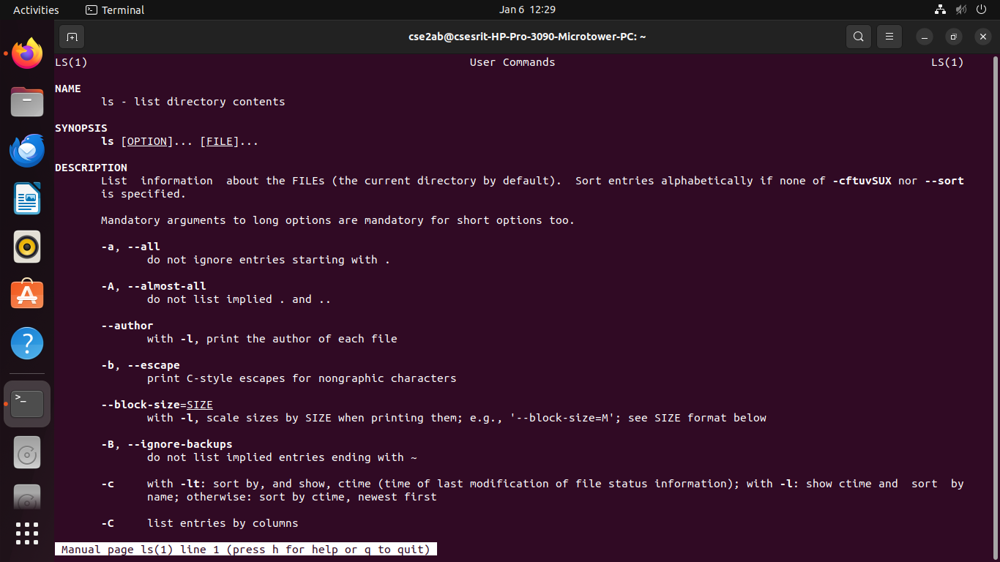

### cmp command output

### touch command output
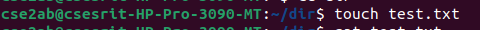
### who am i command output
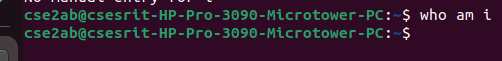
### date command output

### history command output
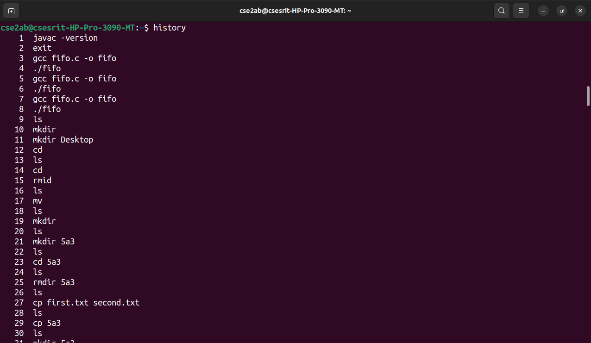
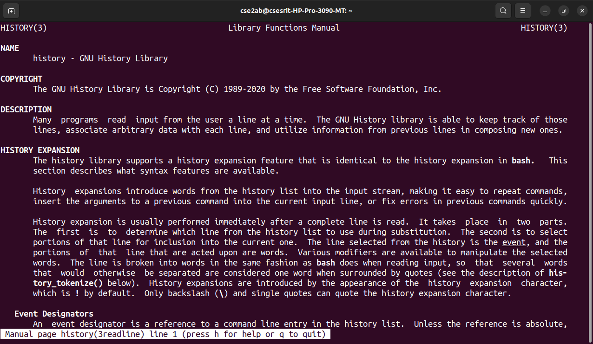

### exit command output

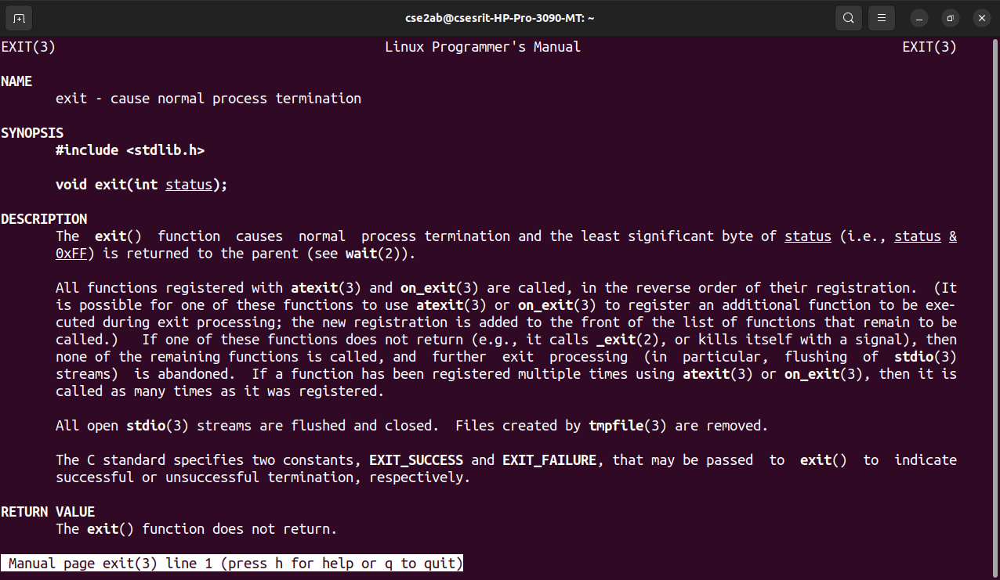

