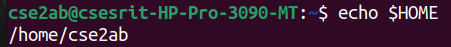
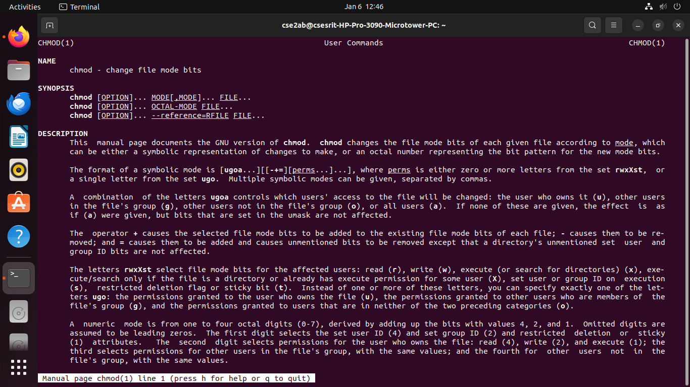

# OS-LAB
operating system lab
#BASIC LINUX COMMANDS
##General command outputs
### bc command output

### bc manual output

### cp command output

### cp manual output

### date command output

### date manual output

### cat command output

### cat manual output

### echo command output

### echo manual output

### mv command output

### mv manual output

### rmdir command output

### rm command output

### rm manual output

### tty command output

### tty manual output

### who command output

### uname command output

### uname manual output

### mkdir command output

### mkdir manual output

### pwd command output

### chmod command output

### chmod manual output

### cd command output

### cd manual output

### ls command output

### ls manual output

### ls -a command output

### ls -l command output

### ls dir command output

### ls -r command output

### ls -x dir command output

### cmp command output

### cmd manual output

### touch command output

### who am i command output

### date command output

### date day command output

### date time command output

### date year command output

### date hour command output

### history command output

### history manual output

### exit command output

